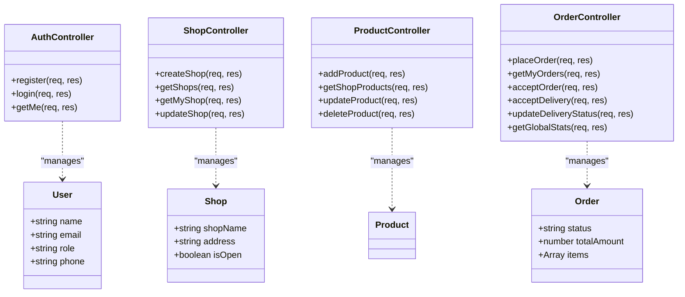

# Class Diagram

The Class Diagram shows the structure of the system's models and controllers, representing the backend logic.

```mermaid
classDiagram
    class AuthController {
        +register(req, res)
        +login(req, res)
        +getMe(req, res)
    }

    class ShopController {
        +createShop(req, res)
        +getShops(req, res)
        +getMyShop(req, res)
        +updateShop(req, res)
    }

    class ProductController {
        +addProduct(req, res)
        +getShopProducts(req, res)
        +updateProduct(req, res)
        +deleteProduct(req, res)
    }

    class OrderController {
        +placeOrder(req, res)
        +getMyOrders(req, res)
        +acceptOrder(req, res)
        +acceptDelivery(req, res)
        +updateDeliveryStatus(req, res)
        +getGlobalStats(req, res)
    }

    class User {
        +string name
        +string email
        +string role
        +string phone
    }

    class Shop {
        +string shopName
        +string address
        +boolean isOpen
    }

    class Order {
        +string status
        +number totalAmount
        +Array items
    }

    AuthController ..> User : "manages"
    ShopController ..> Shop : "manages"
    OrderController ..> Order : "manages"
    ProductController ..> Product : "manages"
```
