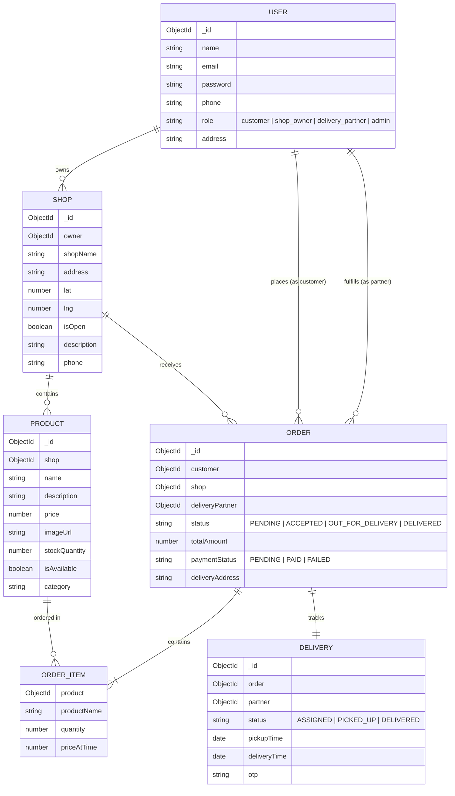

# ER Diagram

The ER Diagram details the database schema and the relationships between different entities (User, Shop, Product, Order, and Delivery).

```mermaid
erDiagram
    USER ||--o{ SHOP : "owns"
    USER ||--o{ ORDER : "places (as customer)"
    USER ||--o{ ORDER : "fulfills (as partner)"
    SHOP ||--o{ PRODUCT : "contains"
    SHOP ||--o{ ORDER : "receives"
    ORDER ||--|{ ORDER_ITEM : "contains"
    ORDER ||--|| DELIVERY : "tracks"
    PRODUCT ||--o{ ORDER_ITEM : "ordered in"

    USER {
        ObjectId _id
        string name
        string email
        string password
        string phone
        string role "customer | shop_owner | delivery_partner | admin"
        string address
    }

    SHOP {
        ObjectId _id
        ObjectId owner
        string shopName
        string address
        number lat
        number lng
        boolean isOpen
        string description
        string phone
    }

    PRODUCT {
        ObjectId _id
        ObjectId shop
        string name
        string description
        number price
        string imageUrl
        number stockQuantity
        boolean isAvailable
        string category
    }

    ORDER {
        ObjectId _id
        ObjectId customer
        ObjectId shop
        ObjectId deliveryPartner
        string status "PENDING | ACCEPTED | OUT_FOR_DELIVERY | DELIVERED"
        number totalAmount
        string paymentStatus "PENDING | PAID | FAILED"
        string deliveryAddress
    }

    ORDER_ITEM {
        ObjectId product
        string productName
        number quantity
        number priceAtTime
    }

    DELIVERY {
        ObjectId _id
        ObjectId order
        ObjectId partner
        string status "ASSIGNED | PICKED_UP | DELIVERED"
        date pickupTime
        date deliveryTime
        string otp
    }
```
