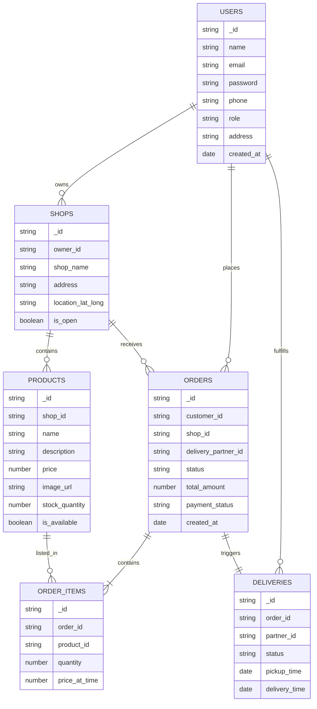

# ER Diagram

```mermaid
erDiagram
    USERS {
        string _id
        string name
        string email
        string password
        string phone
        string role
        string address
        date created_at
    }

    SHOPS {
        string _id
        string owner_id
        string shop_name
        string address
        string location_lat_long
        boolean is_open
    }

    PRODUCTS {
        string _id
        string shop_id
        string name
        string description
        number price
        string image_url
        number stock_quantity
        boolean is_available
    }

    ORDERS {
        string _id
        string customer_id
        string shop_id
        string delivery_partner_id
        string status
        number total_amount
        string payment_status
        date created_at
    }

    ORDER_ITEMS {
        string _id
        string order_id
        string product_id
        number quantity
        number price_at_time
    }

    DELIVERIES {
        string _id
        string order_id
        string partner_id
        string status
        date pickup_time
        date delivery_time
    }

    USERS ||--o{ SHOPS : owns
    USERS ||--o{ ORDERS : places
    SHOPS ||--o{ PRODUCTS : contains
    SHOPS ||--o{ ORDERS : receives
    ORDERS ||--|{ ORDER_ITEMS : contains
    PRODUCTS ||--o{ ORDER_ITEMS : listed_in
    USERS ||--o{ DELIVERIES : fulfills
    ORDERS ||--|| DELIVERIES : triggers
```
