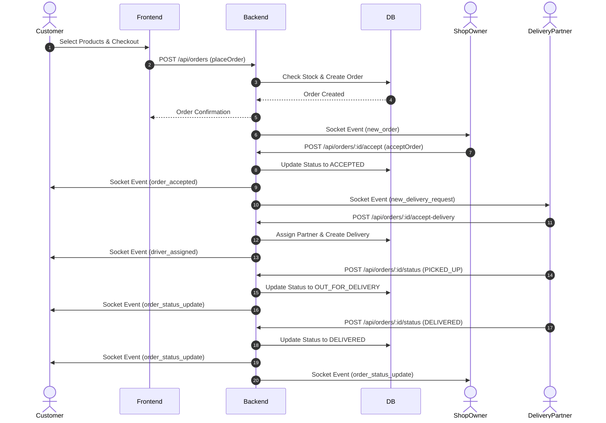

# Sequence Diagram: Order Placement & Delivery

This diagram illustrates the step-by-step process of a customer placing an order and its subsequent fulfillment.

```mermaid
sequenceDiagram
    autonumber
    actor Customer
    participant Frontend
    participant Backend
    participant DB
    actor ShopOwner
    actor DeliveryPartner

    Customer->>Frontend: Select Products & Checkout
    Frontend->>Backend: POST /api/orders (placeOrder)
    Backend->>DB: Check Stock & Create Order
    DB-->>Backend: Order Created
    Backend-->>Frontend: Order Confirmation
    Backend->>ShopOwner: Socket Event (new_order)
    
    ShopOwner->>Backend: POST /api/orders/:id/accept (acceptOrder)
    Backend->>DB: Update Status to ACCEPTED
    Backend->>Customer: Socket Event (order_accepted)
    Backend->>DeliveryPartner: Socket Event (new_delivery_request)

    DeliveryPartner->>Backend: POST /api/orders/:id/accept-delivery
    Backend->>DB: Assign Partner & Create Delivery
    Backend->>Customer: Socket Event (driver_assigned)
    
    DeliveryPartner->>Backend: POST /api/orders/:id/status (PICKED_UP)
    Backend->>DB: Update Status to OUT_FOR_DELIVERY
    Backend->>Customer: Socket Event (order_status_update)

    DeliveryPartner->>Backend: POST /api/orders/:id/status (DELIVERED)
    Backend->>DB: Update Status to DELIVERED
    Backend->>Customer: Socket Event (order_status_update)
    Backend->>ShopOwner: Socket Event (order_status_update)
```
