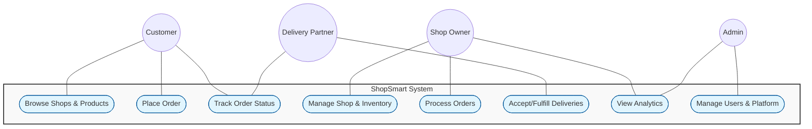

# Use Case Diagram

The Use Case Diagram illustrates the primary actors and their interactions with the ShopSmart system.

```mermaid
flowchart TD
    %% Actors
    Customer((Customer))
    ShopOwner((Shop Owner))
    DeliveryPartner((Delivery Partner))
    Admin((Admin))

    %% System Boundary
    subgraph ShopSmartSystem [ShopSmart System]
        UC1([Browse Shops & Products])
        UC2([Place Order])
        UC3([Track Order Status])
        UC4([Manage Shop & Inventory])
        UC5([Process Orders])
        UC6([Accept/Fulfill Deliveries])
        UC7([View Analytics])
        UC8([Manage Users & Platform])
    end

    %% Relationships
    Customer --- UC1
    Customer --- UC2
    Customer --- UC3

    ShopOwner --- UC4
    ShopOwner --- UC5
    ShopOwner --- UC7

    DeliveryPartner --- UC6
    DeliveryPartner --- UC3

    Admin --- UC8
    Admin --- UC7

    %% Styling
    style ShopSmartSystem fill:#f9f9f9,stroke:#333,stroke-width:2px
    style UC1 fill:#e1f5fe,stroke:#01579b
    style UC2 fill:#e1f5fe,stroke:#01579b
    style UC3 fill:#e1f5fe,stroke:#01579b
    style UC4 fill:#e1f5fe,stroke:#01579b
    style UC5 fill:#e1f5fe,stroke:#01579b
    style UC6 fill:#e1f5fe,stroke:#01579b
    style UC7 fill:#e1f5fe,stroke:#01579b
    style UC8 fill:#e1f5fe,stroke:#01579b
```
